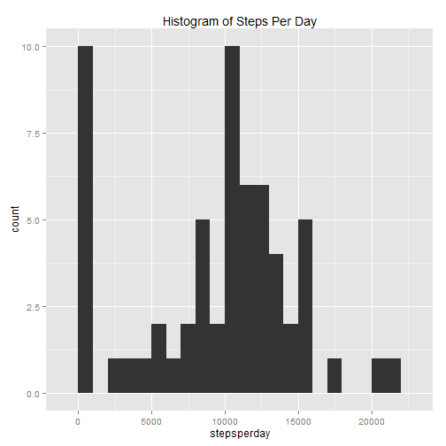
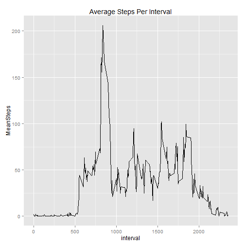
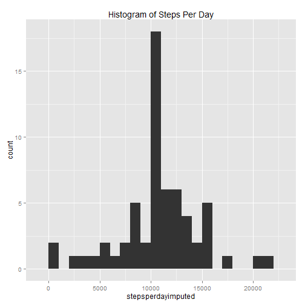
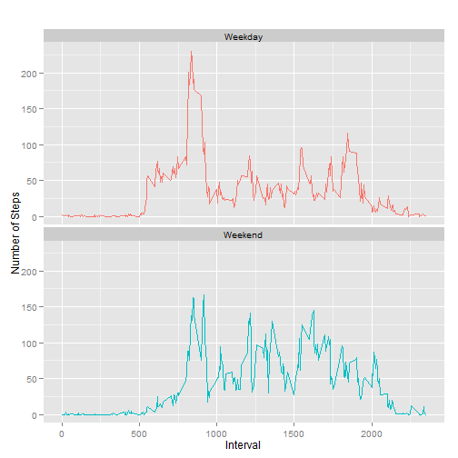

Load Libraries

```r
library(ggplot2)
library(plyr)
```

## Loading and preprocessing the data
Unzip and load file and convert date

```r
activity <- read.csv(unz("activity.zip","activity.csv"))
activity$date <- as.Date(activity$date)
```


## What is mean total number of steps taken per day?
Apply sum and ignore NA values, plot to Histogram, and find Mean and Median

```r
stepsperday <- tapply(activity$steps,activity$date,sum,na.rm=TRUE)
qplot(stepsperday, geom="histogram", binwidth=1000, main="Histogram of Steps Per Day")
```

 

```r
mean(stepsperday)
```

```
## [1] 9354
```

```r
median(stepsperday)
```

```
## [1] 10395
```

## What is the average daily activity pattern?

```r
stepsperinterval <-ddply(activity,.(interval), summarize,MeanSteps= mean(steps, na.rm=TRUE))
qplot(interval, MeanSteps,data =stepsperinterval, geom="line",  main="Average Steps Per Interval")
```

 

Which Interval has the maximum number of mean steps


```r
stepsperinterval[stepsperinterval$MewdaywendanSteps==max(stepsperinterval$MeanSteps),]
```

```
## [1] interval  MeanSteps
## <0 rows> (or 0-length row.names)
```

## Imputing missing values

How Many Missing (NA) Steps are in the data


```r
sum(is.na(activity$steps))
```

```
## [1] 2304
```

Create a dataset where the meanSteps for the interval is applied, and use to overwrite NA where applicable

```r
activityImputed <- merge(activity,stepsperinterval)
activityImputed[is.na(activityImputed$steps),"steps"] <-activityImputed[is.na(activityImputed$steps),"MeanSteps"]
```


Apply sum and ignore NA values, plot to Histogram, and find Mean and Median for imputed dataset

```r
stepsperdayimputed <- tapply(activityImputed$steps,activityImputed$date,sum,na.rm=TRUE)
qplot(stepsperdayimputed, geom="histogram", binwidth=1000, main="Histogram of Steps Per Day")
```

 

```r
mean(stepsperdayimputed)
```

```
## [1] 10766
```

```r
median(stepsperdayimputed)
```

```
## [1] 10766
```

How has the imputation affected the Mean and Median Values

```r
mean(stepsperdayimputed)-mean(stepsperday)
```

```
## [1] 1412
```

```r
median(stepsperdayimputed)-median(stepsperday)
```

```
## [1] 371.2
```
## Are there differences in activity patterns between weekdays and weekends?

Create a weekday/weekend factor and summarise 


```r
activityImputed$wdaywend <- as.factor(ifelse(weekdays(activityImputed$date) %in% c("Saturday","Sunday"), "Weekend", "Weekday"))
wdaywendcomp <-ddply(activityImputed,.(interval,wdaywend), summarize,MeanSteps= mean(steps, na.rm=TRUE))
```

Create a panel line plot comparing Weekday and Weekend

```r
qplot(interval, MeanSteps,data =wdaywendcomp, geom="line", color = wdaywend, main="", xlab ="Interval", ylab = "Number of Steps")+ theme(legend.position = "none") + facet_grid( .~ wdaywend)+ facet_wrap(~wdaywend, ncol=1)
```

 
